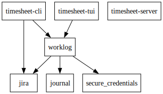

# Time Sheet

Rust project to extract and update hours logged in Jira.

Jira instance for testing: https://norns.atlassian.net

<!-- TOC -->
* [Time Sheet](#time-sheet)
  * [Directory structure](#directory-structure)
    * [Binaries:](#binaries)
    * [Libraries:](#libraries)
    * [Other stuff](#other-stuff)
  * [Dependency graph](#dependency-graph)
  * [Maintainer notes](#maintainer-notes)
    * [Generate `pdf` from markdown files](#generate-pdf-from-markdown-files)
    * [Separating unit tests and integration tests](#separating-unit-tests-and-integration-tests)
      * [Integration tests execution](#integration-tests-execution)
  * [Cross compiling to Windows on MacOS](#cross-compiling-to-windows-on-macos)
<!-- TOC -->

## Directory structure
The project consists of the following modules:

### Binaries:

* `cli` - command line utility [`timesheet`](./cli/README.md) to register logged hours into Jira.
* `tui` - text user interface as an alternative to the cli
* `server` - attempt to create a server for REST/gRPC

### Libraries:

* `jira` - library with various functions to retrieve data from Jira
* `worklog` - common functionality to be shared between the various clients
* `secure_credentials` - secure credentials for macOS clients

### Other stuff

 - `docs` - documentation and documentation assets
 - 
## Dependency graph

Here is an overview of the dependencies, extracted from `Cargo.toml` 
using: `cargo depgraph --workspace-only | dot -Tsvg -o docs/assets/deps.svg`



## Maintainer notes

### Generate `pdf` from markdown files

`pandoc README.md -o README.pdf`

> To get `pandoc` on MacOS use `brew install pandoc basictex`

### Separating unit tests and integration tests

Keeping unit tests separated from integration tests, the latter which require access to external services, is 
crucial to maintain the code base.

Integration tests for any crate are located in the `tests/` directory.

#### Integration tests execution

*NOTE!* The following environment variables are required to execute the integration tests:
```shell
export JIRA_HOST=https://norns.atlassian.net
export JIRA_USER=your_jira_user@domain.name
export JIRA_TOKEN="ATATT3xFfGF0vIWdxrk1yqkbq5D4Q8EHp49NyxrWF-f6c89spnt..... . .-RIxM=9262A4F7" 
```

To run only integration tests:
```
# Executes all tests embeddd in the code structure of the library crates
cargo test --workspace --lib

# Executes all tests embeddd in the code structure of the binary crates
# like for instance the cli and tui clients. 
cargo test --workspace --bins

# Runs the integration tests in tests/ directory
cargo test --workspace --tests

# Runs all tests
cargo test --workspace --all-targets
```

## Cross compiling to Windows on MacOS

How to cross compile from Mac to Windows:

```shell
brew install mingw-w64
rustup target add x86_64-pc-windows-gnu
cargo build --target x86_64-pc-windows-gnu
```

**Note** This was the first entry I found on Google in June 2023. The Windows executable
is rather large, so perhaps there is better way to do this.

## Commit messages and semantic versioning

We follow these guidelines https://www.conventionalcommits.org/en/v1.0.0/#summary