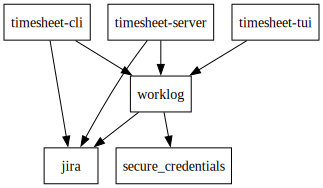

# Time Sheet

Rust project to extract and update hours logged in Jira.

The project consists of the following modules:

Binaries:

* `cli` - command line utility `timesheet-cli` to register logged hours into Jira.
* `tui` - text user interface as an alternative to the cli
* `server` - attempt to create a server for REST/gRPC

Libraries:

* `common` - common types shared between various
* `jira` - library with various functions to retrieve data from Jira
* `worklog` - common functionality to be shared between the various clients
* `local_repo` - Sqlite DBMS repository
* `secure_credentials` - secure credentials for macOS clients

## How to build on MacOS

The script `build.sh` will compile all the binaries and upload them
to the OneDrive directory.

## Cross compiling to Windows on MacOS

How to cross compile from Mac to Windows:

```shell
brew install mingw-w64
rustup target add x86_64-pc-windows-gnu
cargo build --target x86_64-pc-windows-gnu
```

**Note** This was the first entry I found on Google in June 2023. The Windows executable
is rather large, so perhaps there is better way to do this.

Here is an overview of the dependencies, extracted from `Cargo.toml` using: `cargo depgraph --workspace-only | dot -Tsvg -o docs/assets/deps.svg`



## Maintainer notes

### Generate `pdf` from markdown files

`pandoc README.md -o README.pdf`

> To get `pandoc` on MacOS use `brew install pandoc basictex`
