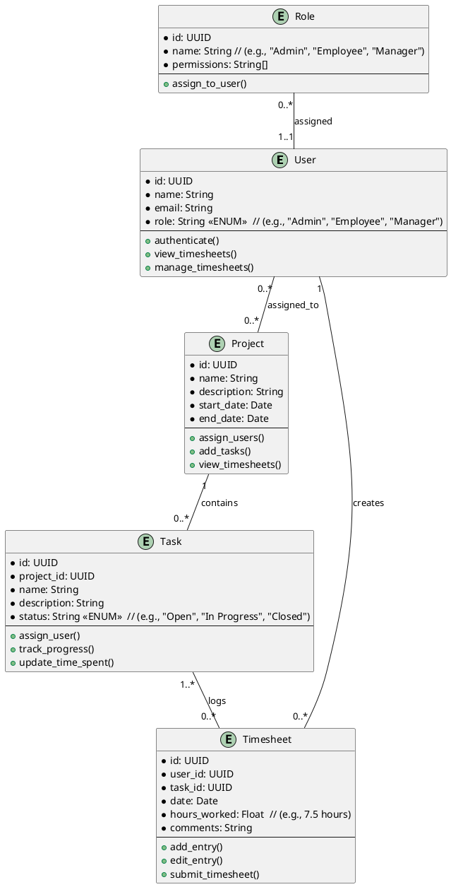

# Steinars notes


## Todo
- [ ] Derive keychain service name from the application name space name
- [ ] Define a separate Jira account for the integration tests `norn@balder.no` or something like that.
      I am not sure if we can use a fake name or need the name to be an actual email account somewhere.
## Setting the environment variables

```
export JIRA_HOST=https://norns.atlassian.com/jira
export JIRA_USER=norns@balder.no
export JIRA_TOKEN=$(security find-generic-password -s com.norns.timesheet.jira -a steinar.cook@gmail.com -w)
```

## How configuration parameters are loaded and merged with KeyChain

The configuration file is loaded from disk

```plantuml
control ApplicationRuntime
control "worklog::config" as wl
control "macos" as macos_sec

ApplicationRuntime -> wl : config::load()

activate wl
wl -> wl : app_config = read(&config_path)

alt macOS
      activate wl
      alt !secure_credentials::get_secure_token() && jira.has_valid_token()
        wl -> wl: create_configuration_file()
      end
      wl -> wl: merge_jira_token_from_keychain(app_config)  
      activate wl
        wl -> macos_sec : get_secure_token(service, user)
        activate macos_sec
        macos_sec --> wl : token
        deactivate macos_sec
      deactivate wl
      wl -> wl : app_config.jira.token = token
      deactivate wl
end
wl --> ApplicationRuntime : app_config: AppConfiguration 
deactivate wl
```

## Generic Data model for timesheet

