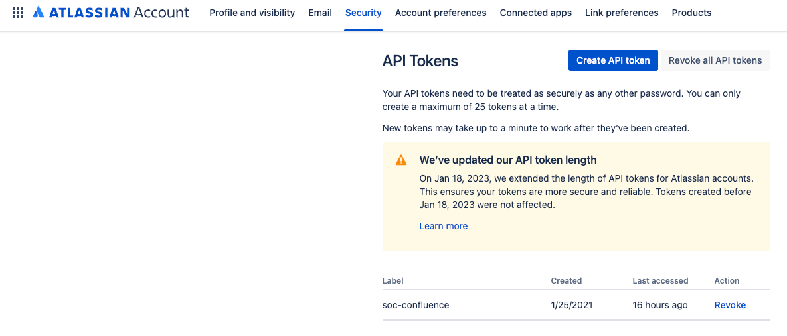
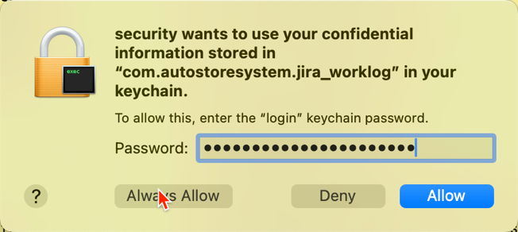

# The Jira worklog utility

The `jira_worklog` utility allows you to enter your Jira worklog entries as easy and simple
as possible from the command line. The main objective for this utility is speed. If you don't like 
command line applications, don't use this tool :-)

This utility will let you add your work log entries in less than 1 second.

A quick status report for the last 30 days typically executes in less than 1 second.

All entries added to Jira will also be written to a local Sqlite database, which allows reports to 
be generated very fast.

This database is also used for status reports. 

The local database may be synchronised with Jira using the `sync` sub command.

Disclaimer: Network latency and the response time of Jira is the main culprit of any delays

<!-- TOC -->
* [The Jira worklog utility](#the-jira-worklog-utility)
  * [Installation](#installation)
    * [Using `curl` to verify your security token](#using-curl-to-verify-your-security-token)
    * [Installing on macOS](#installing-on-macos)
    * [Notes on security](#notes-on-security)
      * [macOS specifics for the Jira Security token](#macos-specifics-for-the-jira-security-token)
      * [Removing local configuration files](#removing-local-configuration-files)
  * [How to specify the duration](#how-to-specify-the-duration)
    * [Local database file](#local-database-file)
  * [Examples](#examples)
    * [Adding worklog entries](#adding-worklog-entries)
    * [Status of your worklog entries](#status-of-your-worklog-entries)
    * [Create a status report from most used time codes](#create-a-status-report-from-most-used-time-codes)
    * [Removing entries](#removing-entries)
    * [Synchronising the local database with Jira](#synchronising-the-local-database-with-jira)
    * [Listing all available time codes](#listing-all-available-time-codes)
    * [Debug](#debug)
<!-- TOC -->

````shell
# Add one day of work to Jira issue TIME-94
jira_worklog add -i time-94 -d 1d

# Give me a status of all work log entries for the last 30 days
jira_worklog status

# Give me status for the last 30 days for time-94 and time-40
jira_worklog status -i time-94 time-40
````

See the detailed examples below for more details.

## Installation

Once you have downloaded and installed `jira_worklog` in your **path**.
Like, for instance, `$HOME/.local/bin`:

1. Obtain a Jira API security token from:

    1. Log in to Jira
    1. Click on the picture of yourself in the upper right corner ("Your profile and settings")
    1. Click "Manage account"
    1. Click "Security" 
    1. Choose "Create and manage API tokens" almost at the bottom of the page
    1. Click "Create your API token" and copy the token to your clip board
2. Execute this command to create the configuration file:

    ````shell
   # Creates the configuration file and stores your credentials in it
    jira_worklog config --user steinar.cook@autostoresystem.com --token vbF**************E3
    ````

### Using `curl` to verify your security token

Here is how you can retrieve data from Jira using the `curl` utility from the command line:

````shell
curl --request GET \
  --url 'https://autostore.atlassian.net/rest/api/2/myself' \
  --user '<your email here>@autostoresystem.com:<paste your security token here>' \
  --header 'Accept: application/json'
````

### Installing on macOS

There are some extra security built into the macOS which prevents you from running potential malware.
Consequently, you will see this error message if you attempt to run `jira_worklog`:


To fix this:

```shell
# Move to the directory where you installed
cd [to_the_directory_where_you_have_installed_jira_worklog]

chmod a+rx ./jira_worklog && xattr -d com.apple.quarantine ./jira_worklog
```

This should solve the problem.

### Notes on security

The configuration file is stored without encryption in a location, 
which depends on the operating system you are using.
See the table below for details.

If you think your machine has been compromised, go to Jira account ira and "Revoke" the API key.

#### macOS specifics for the Jira Security token
On macOS, the Jira Security Access Token is stored in the built-in KeyChain.

When `jira_worklog` attempts to access your macOS Keychain, this window will pop up.
It is a good idea to press `Always Allow` to save you some time :-)


Here is a neat command to work with security tokens and passwords
on macOS:
````shell
# This will list the entire contents of the `jira_worklog` entry from the keychain
security find-generic-password -s com.autostoresystem.jira_worklog -a your.name@company.com -g
````

#### Removing local configuration files
You can remove your local configuration file using the command: `jira_worklog config --remove`

| Operating system     | Config file location                                                    |
|----------------------|-------------------------------------------------------------------------|
| macOS:               | `/Users/${USER}/Library/Preferences/com.autostore.jira_worklog`         |
| Windows:             | `C:\Users\%USERNAME%\AppData\Roaming\com.autostore\jira_worklog\config` |
| Linux:               | `/home/${USER}/.config/jira_worklog`                                    |

Note! For macOS: The Jira Security Access token stored in the Keychain, will not be deleted
## How to specify the duration

You can specify the duration of your work using weeks, days, hours and minutes.

The syntax is pretty straight forward, you simply specify a number followed by the unit.
To combine units, simply concatenate them. The formal syntax is described below.
Note that `<number>` represents any positive number using either `,` or `.` as the decimal separator.
However, you may not specify fractions of minutes (for obvious reasons) :

````shell
<number>w<number>d<number>h<integer number>m
````

Here is an example using all the possible options:
````shell
# Specify a duration of 1,5 week, 2,5 days, 5,25 hours and 30min like this
jira_worklog add -i time-158 -d 1,5w2,5d5,25h30min
````
### Local database file
The local database file can be found here:

| Operating System | Local Sqlite database file                                                       |
|------------------|----------------------------------------------------------------------------------|
| macOS            | /Users/${USER}/Library/Application Support/com.autostore.jira_worklog/worklog.db |
| Windows          | C:\Users\%USERNAME%\AppData\Roaming\jira_worklog\worklog.db                      |
| Linux            | /home/${LOGNAME}/.local/share/jira_worklog/worklog.db                            |

NOTE! I have neither access to a Windows nor a Linux system, so the specified paths might not be correct. 

## Examples

Here are some examples on how to use the utility.

### Adding worklog entries

````shell
# Registers 1 hour of work on TIME-94 with a comment
# The starting point will be current time less 1 hour
jira_worklog add -i time-94 -d 1h -c "I did some great work for AutoStore"


# Registers 1 hour of work on TIME-94 at 11:00 today without a comment
jira_worklog add -i time-94 -d 1h -s 11:00

# Registers 1 day of work (7.5h) on TIME-94, starting at 08:00 today, no comments
jira_worklog add -i time-94 -d 1d

# Registers 1 day (7.5 hours) of work starting at 08:00 today with no comment
jira_worklog add -i time-94 -d 1d

#
# Add 1d of work last friday, 1d of work on last thursday, 4h of work
# last Wednesday and 1,5h on last Tuesday
jira_worklog add -i time-94 -d Fri:1d Thu:1d Wed:4h Tue:1,5h
````

Given this command:

`````shell
jira_worklog add -i time-94 -d 13h -c "Meetings and managerial work"
`````

You will get a receipt looking something like this:

`````shell
Adding single entry
Using these parameters as input:
        Issue: TIME-94
        Started: 2023-06-05T08:12:31.467244-06:00  (computed)
        Duration: 46800s
        Comment: Meetings and managerial work
Added work log entry Id: 217258 Time spent: 1d 5h 30m Time spent in seconds: 46800 Comment: Meetings and managerial work
`````

### Status of your worklog entries

````shell
#
# Shows the status from a given date
jira_worklog status -i time-40 time-147 time-117 -a 2023-05-01
````

This would give you something like this:

`````shell
Version: 0.9.3
Issue    IssueId Id      Weekday Started                Time spent Comment
TIME-147 211874  331947  Fri     2024-11-01 08:00 +0100 07:30      
TIME-147 211874  332376  Mon     2024-11-04 09:21 +0100 07:30      
TIME-147 211874  333744  Tue     2024-11-05 08:00 +0100 07:30      
TIME-147 211874  333745  Wed     2024-11-06 08:00 +0100 07:30      
TIME-147 211874  333746  Thu     2024-11-07 08:00 +0100 07:30      
TIME-147 211874  333747  Fri     2024-11-08 08:00 +0100 07:30      
TIME-147 211874  334641  Mon     2024-11-11 08:00 +0100 07:30      
TIME-147 211874  334642  Tue     2024-11-12 08:00 +0100 07:30      
TIME-147 211874  335773  Wed     2024-11-13 08:00 +0100 07:30      
TIME-147 211874  335774  Thu     2024-11-14 08:00 +0100 04:00      
TIME-147 211874  336668  Tue     2024-11-19 08:00 +0100 07:30      
TIME-147 211874  337500  Tue     2024-11-19 08:00 +0100 07:30      
TIME-147 211874  337501  Wed     2024-11-20 08:00 +0100 07:30      
TIME-147 211874  337502  Thu     2024-11-21 08:00 +0100 07:30      Bla bla bla
TIME-155 214674  336667  Mon     2024-11-18 08:00 +0100 05:00      Lysaker - Gardermoen - Vats
TIME-166 219027  336669  Sat     2024-11-16 08:00 +0100 02:00      
TIME-166 219027  336665  Sun     2024-11-17 08:00 +0100 01:00      
TIME-166 219027  336666  Mon     2024-11-18 08:00 +0100 07:30      

CW 44 from 2024-10-28 to 2024-11-03
Time code         Mon   Tue   Wed   Thu   Fri   Sat   Sun Total
--------------- ----- ----- ----- ----- ----- ----- ----- -----
TIME-147          -     -     -     -   07:30   -     -   07:30
TIME-155          -     -     -     -     -     -     -   00:00
TIME-166          -     -     -     -     -     -     -   00:00
--------------- ----- ----- ----- ----- ----- ----- ----- -----
Week total        -     -     -     -   07:30   -     -   07:30
=============== ===== ===== ===== ===== ===== ===== ===== =====

CW 45 from 2024-11-04 to 2024-11-10
Time code         Mon   Tue   Wed   Thu   Fri   Sat   Sun Total
--------------- ----- ----- ----- ----- ----- ----- ----- -----
TIME-147        07:30 07:30 07:30 07:30 07:30   -     -   37:30
TIME-155          -     -     -     -     -     -     -   00:00
TIME-166          -     -     -     -     -     -     -   00:00
--------------- ----- ----- ----- ----- ----- ----- ----- -----
Week total      07:30 07:30 07:30 07:30 07:30   -     -   37:30
=============== ===== ===== ===== ===== ===== ===== ===== =====

CW 46 from 2024-11-11 to 2024-11-17
Time code         Mon   Tue   Wed   Thu   Fri   Sat   Sun Total
--------------- ----- ----- ----- ----- ----- ----- ----- -----
TIME-147        07:30 07:30 07:30 04:00   -     -     -   26:30
TIME-155          -     -     -     -     -     -     -   00:00
TIME-166          -     -     -     -     -   02:00 01:00 03:00
--------------- ----- ----- ----- ----- ----- ----- ----- -----
Week total      07:30 07:30 07:30 04:00   -   02:00 01:00 29:30
=============== ===== ===== ===== ===== ===== ===== ===== =====

CW 47 from 2024-11-18 to 2024-11-24
Time code         Mon   Tue   Wed   Thu   Fri   Sat   Sun Total
--------------- ----- ----- ----- ----- ----- ----- ----- -----
TIME-147          -   15:00 07:30 07:30   -     -     -   30:00
TIME-155        05:00   -     -     -     -     -     -   05:00
TIME-166        07:30   -     -     -     -     -     -   07:30
--------------- ----- ----- ----- ----- ----- ----- ----- -----
Week total      12:30 15:00 07:30 07:30   -     -     -   42:30
=============== ===== ===== ===== ===== ===== ===== ===== =====
`````

### Create a status report from most used time codes

If you omit the `--issue` option, a list of unique time codes will
be obtained from the local journal on your machine.

```shell
jira_worklog status
```

### Removing entries

We all make mistakes every now then. To remove an entry you need to specify the
`issueId or key` and the `worklog id`:

````shell
# Removes a work log entry for issue TIME-94 with worklog id of 216626
jira_worklog del -i time-94 -w 216626
````

The entry will also be removed from the local journal.

### Synchronising the local database with Jira
To ensure that your local database reflects the current content in Jira, you may use the sub-command `sync`.
All unique time codes found in the local database, will be synchronised with Jira by downloading the data from
Jira and replacing the data in the local database.

````shell
# Synchronise all time codes found in the local database going back 30 days
jira_worklog sync

# Synchronise the specified time codes going after the supplied start date
jira_worklog sync -i time-155 -s 2024-10-01

# Synchronise multiple time codes
jira_worklog sync -i time-155 -i time-166 
````

The output looks something like this:
````shell
Old journal not found so return
Synchronising work logs for these issues:
        time-155
        time-166
Synchronising 1 entries for time code time-155
Synchronising 3 entries for time code time-166
````

### Listing all available time codes

If you want a complete list of all the available time codes:

```shell
jira_worklog codes
```

Output:

```text
TIME-164 ASIO - Sustaining
TIME-163 Service Vehicles - Sustaining
TIME-162 Service Wall - Sustaining
TIME-161 Amazon UWA6 - Customer Project
TIME-160 Cloud Infrastructure & DevOps
TIME-159 1214 Qubit Product Improvement 2024
TIME-158 1215 Robot Radio Wifi
TIME-157 1213 Green Train Release Spring 2025 - Test & Validation
TIME-156 1212 Green Train Release Spring 2025 - Cube Control Software
TIME-155 Travel
TIME-154 Product Management
TIME-153 Product Safety
TIME-152 Scalability - Sustaining
TIME-151 Log Analyzer - Sustaining
TIME-150 Facility Management
TIME-148 Training and Education
TIME-147 Administration
TIME-146 UX - Sustaining
TIME-145 Port Software - Sustaining
.... ......
```

### Debug

A log-file is created behind the scenes if you use the `--verbosity` option, which allows for debugging:

````shell
jira_worklog status -i time-40 -v debug
````

Output would look something like this:

````shell
jira_worklog status -i TIME-40 -v debug
Version: 0.2.7
Logging to /var/folders/ll/ywcp72091yv33vkts306qs0r0000gn/T/jira_worklog.log
Issue    IssueId      Id         Weekday Started                      Time spent
TIME-40  85002        304588     Mon     2024-08-05 08:00 +0200       07:30
TIME-40  85002        304589     Tue     2024-08-06 08:00 +0200       07:30
...... lots of data .....
````

You can specify one of `debug`, `info`, `warn` or `error`
